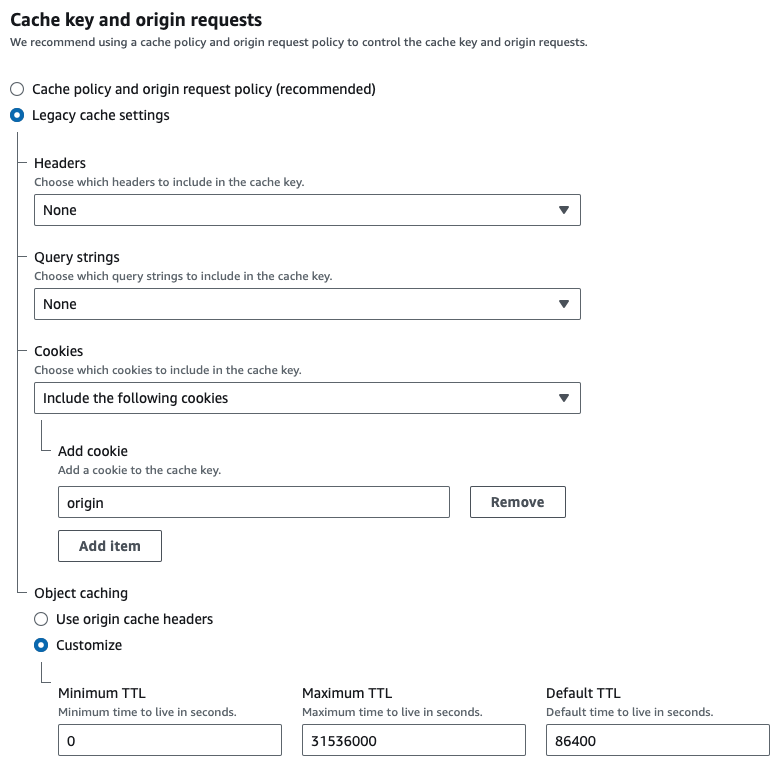

## Lambda Edge

### Buckets

> Nome do bucket 1

```bash
PADRAO-NOME-BUCKET-vitrine-default
```

---

> Nome do bucket 2

```bash
PADRAO-NOME-BUCKET-vitrine-vitrine
```

---

### Config de acesso aos arquivos do Bucket

> Política do bucket

```bash
{
    "Version": "2012-10-17",
    "Statement": [
        {
            "Sid": "PublicReadGetObject",
            "Effect": "Allow",
            "Principal": "*",
            "Action": "s3:GetObject",
            "Resource": "arn:aws:s3:::NOME-DO-BUCKET/*"
        }
    ]
}
```

---

### Config CloudFront

> Cache no CloudFront



---

### Lambda Config

```bash
PADRAO-NOME-LAMBDA-vitrine
```

> Dar permissão de lambda edge permissões básicas

---

### Test

```bash
document.cookie = 'origin=vitrineVirtual'
```

### Links

> Tutorial Youtube: https://www.youtube.com/watch?v=Qtwq8H5kHGc